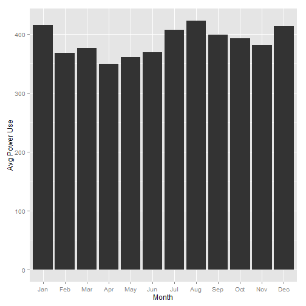

LA Power Bill Application Pitch
========================================================
author: Joanna Widjaja
date: 6/21/2015

Have you ever wondered how much you spend on electricity every month of the year? 
Then this application is for you!

Data Sources
========================================================
The L.A. Power Bill Application takes in historical power usage data from 2005 - 2013. 
Users can select the city, and adjust the rate in cents per kWh as needed. 

There are 2 data sources for the application. 

- Power Consumption Data: taken from the data.lacity.org
- Zipcode and City Data: taken from zipinfo.com 

In addition, I also used a paper by Department of Water and Power, City of Los Angeles to get the default power rate of 0.117 cents per kWh power consumed. 

The Application
========================================================
Below is sample of the Los Angeles power consumption data after final processing.

```
Source: local data table [12 x 4]

          City Month Avg Power Use     Bill
1  LOS ANGELES     1      415.1109 48.56797
2  LOS ANGELES     2      367.6230 43.01189
3  LOS ANGELES     3      376.3105 44.02833
4  LOS ANGELES     4      348.7782 40.80705
5  LOS ANGELES     5      360.0746 42.12873
6  LOS ANGELES     6      368.2460 43.08478
7  LOS ANGELES     7      406.9395 47.61192
8  LOS ANGELES     8      421.8528 49.35678
9  LOS ANGELES     9      398.1109 46.57897
10 LOS ANGELES    10      392.2117 45.88877
11 LOS ANGELES    11      380.7823 44.55152
12 LOS ANGELES    12      412.5605 48.26958
```

Power Usage Trend
========================================================
Below is a plot of the power usage trend of the City of Los Angeles.

 

Benefits of Using The Application
========================================================
The application aggregates historical power consumption data in the Los Angeles area. Users will be able to predict their power usage trends based on their geographical preference with this application. 

Moreover, it also allows users to adjust the electricity rate. The application shows both monthly bills, and total annual bill.

The application is simple to use and gives straightforward breakdown of estimated power bill.

Please access it via this link: https://joannanw.shinyapps.io/POWERBILLAPP

Thank you!


